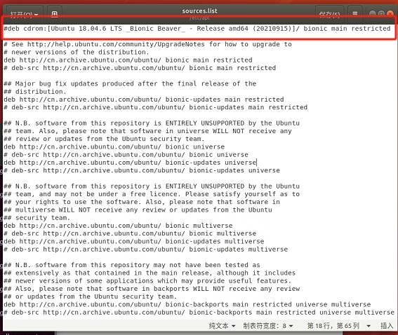
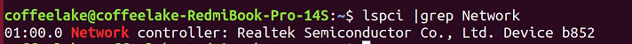
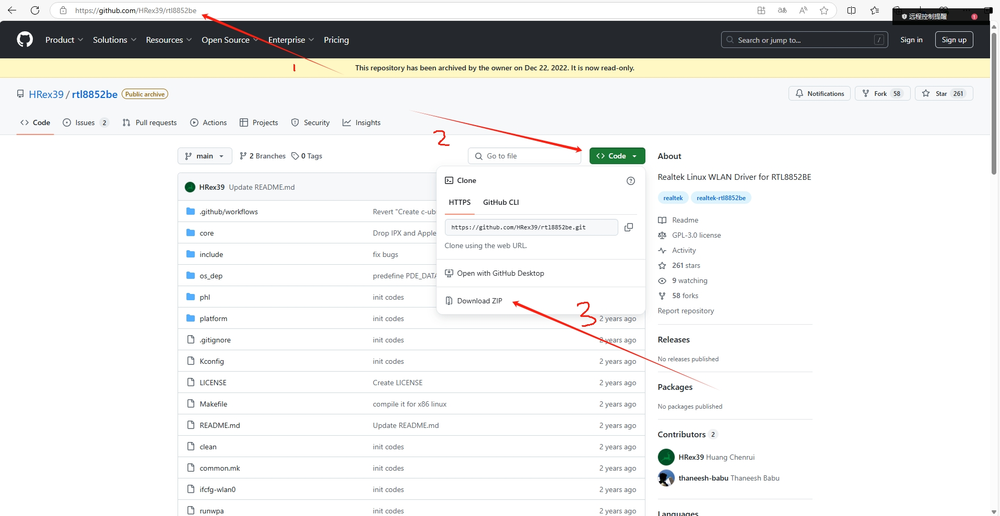
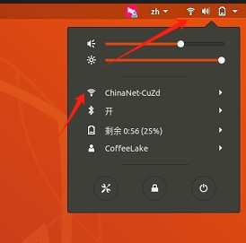

# Author:CoffeeLake

### 问题1

#### 更换介质请把标有的盘片插入驱动器media cdrom再按「回车」键

##### 这个是使用 apt-get install 下载软件时遇到的问题

1.root权限修改`/etc/apt/sources.list`文件

2.目录下打开终端

`sudo gedit sources.list`

​	注释掉deb cdrom:开头的行

3.更新一下apt

`sudo apt-get update`

### 问题2

#### 在使用笔记本安装Ubuntu18.04版本时，会遇到无网络情况，这时需要安装网卡驱动

1.终端查看本设备网卡

`lspci |grep Network` （以b852为例）

2.从GitHub上下载网卡驱动

https://github.com/HRex39/rtl8852be

3.安装

`sudo apt-get update`

`sudo apt-get install gcc make`

`sudo unzip rtl8852be-main.zip`

`cd rtl8852be-main`

`make`

`sudo make install`

`sudo modprobe 8852be`

此时右上角能显示出无线WiFi

